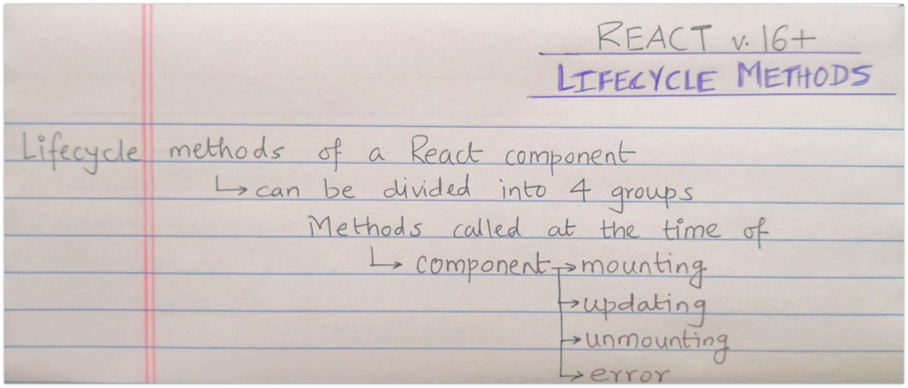
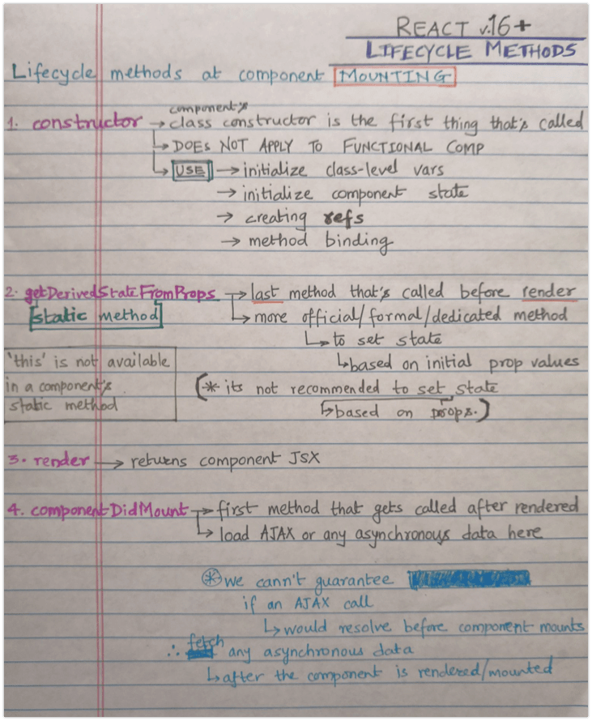
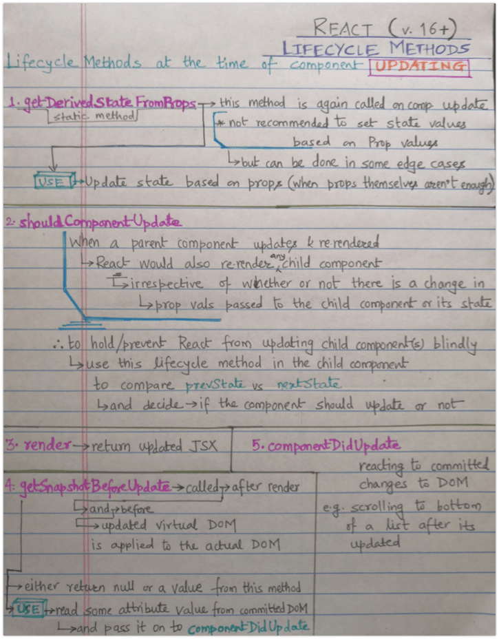
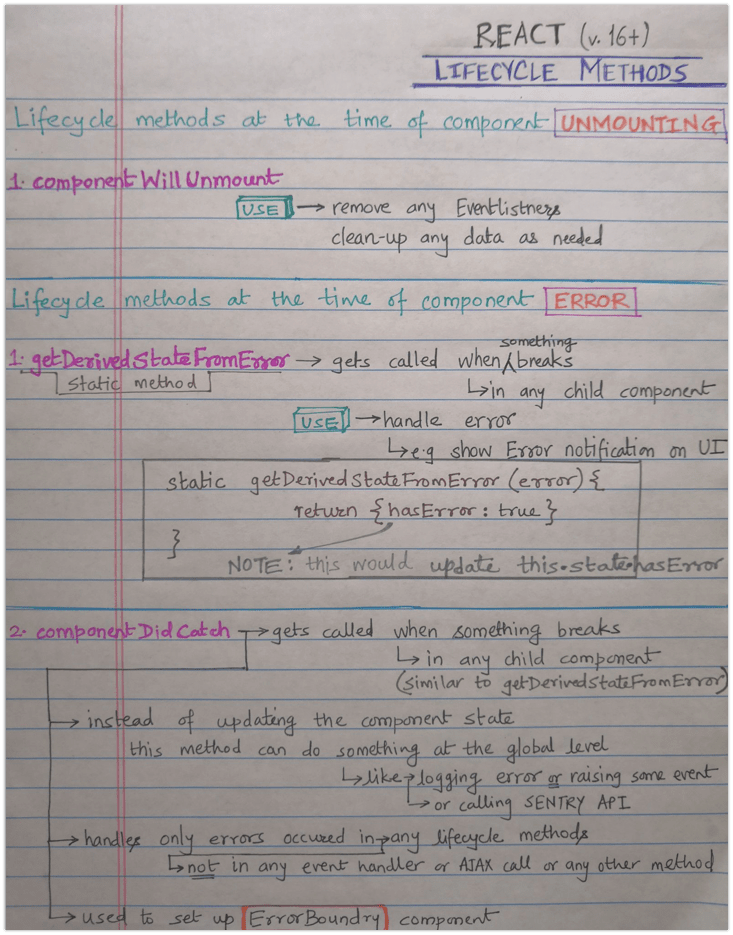

# Lifecycle

## React Component Lifecycle Events

`constructor (props)` Before rendering \# `componentWillMount()` Don’t use this \# `render()` Render \# `componentDidMount()` After rendering \(DOM available\) \#

## Updating

`componentDidUpdate (prevProps, prevState, snapshot)` Use setState\(\) here, but remember to compare props

`shouldComponentUpdate (newProps, newState)`Skips render\(\) if returns false

`render()` Render

`componentDidUpdate (prevProps, prevState)` Operate on the DOM here

## Unmounting events

`componentWillUnmount()` Before DOM removal \#

## Error events

`componentDidCatch()` Catch errors \(16+\) \#

Set initial the state on constructor\(\).

Add DOM event handlers, timers \(etc\) on componentDidMount\(\),

remove event listners in componentWillUnmount\(\).

**My Bold Text, in red color.**{: style="color: red; opacity: 0.80;" }

