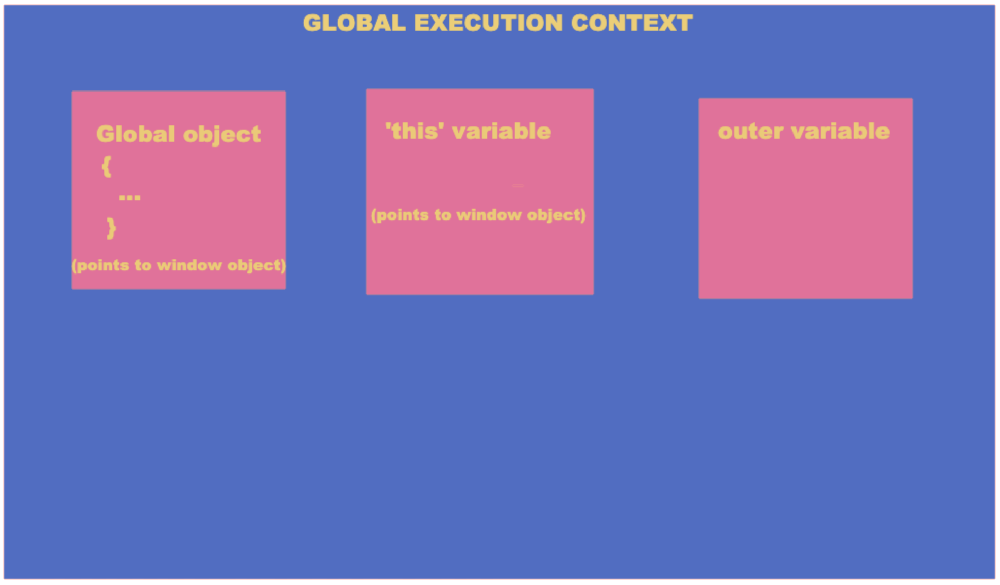

# What is SPA

SPA = a web application that, instead of having multiple HTML pages for its various parts or functionalities, has only single HTML page where it can render the contents of its various parts in response to navigation actions, without having to make a request to the server to fetch another HTML page.

SPAs can be implemented in two ways :

### 1. Tracking application state using the URL

In this approach, the application uses some sort of path identifier \(`pathname`\) in the URL \(`window.location`\) to identify what content is to be rendered on the screen. Application Entry URL-&gt; myapp.com/ User Profile -&gt; myapp.com**/user** shopping Cart -&gt; myapp.com**/cart**

Most of the SPA development frameworks use this approach because with this approach the application can start from a state based on the URL and thus, to share some particular content of the website, the URL can be used.

### **2. Tracking application state internally**

In this approach, The URL remains same for all the parts or sections of the application. The application uses some internal state to track what content is to be rendered.

Application Entry URL-&gt; myapp.com**/** User Profile -&gt; myapp.com**/** shopping Cart -&gt; myapp.com**/**

This not used much by the frameworks. With this approach, the application always starts from a root state that acts as an entry point to the application and thus to share some particular content that website displays at some later state, you would have to also explain the steps to go to that state from the root state of the website.

## `window.location`

SPA's use the various properties provided by `window.location` in javascript to figure out what content is to be rendered on the screen.



## Routers

SPA frameworks provide some sort of routing feature to allow you to map the contents to be rendered to `pathname` of the current URL

```text
const appRoutes = [
{ path: '/', component: RootComponent },
{ path: '/user', component: UserProfileComponent },
{ path: '/cart', component: ShoppingCartComponent }
]
```

The router would keep observing the `pathname` of the current URL on user's browser and when it notices a change in the URL, it triggers a re-render Additionally , the routers can also support the other properties of `window.location` like `hash` and `query strings` to provide some additional data to further filter or customize the contents.

## Browser Session and Browser History API

Browsers maintain a `browsing context` for each tab:

```text
{
  sessionHistory: 
  [ 
    {
      url: https://www.myapp.com,
      window: {
         document: {
             location: {
             protocol: 'http',
             hostname: 'www.myapp.com',
             pathname: '/user',
             search: '?id=user1',
             hash: '#preferences'
         }
      }
    }, 
    ...,
    ...
  ]


}
```

## Well explained here:

After reading above sections - directly jump to the section - How Browsers Handle Locations explained at [https://medium.com/@pshrmn/demystifying-single-page-applications-3068d0555d46](https://medium.com/@pshrmn/demystifying-single-page-applications-3068d0555d46)

